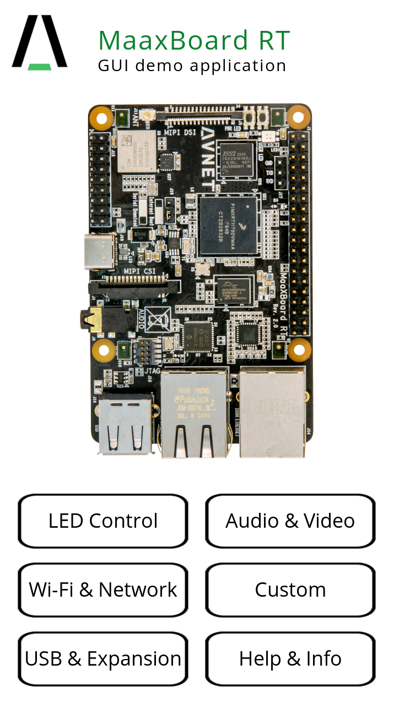
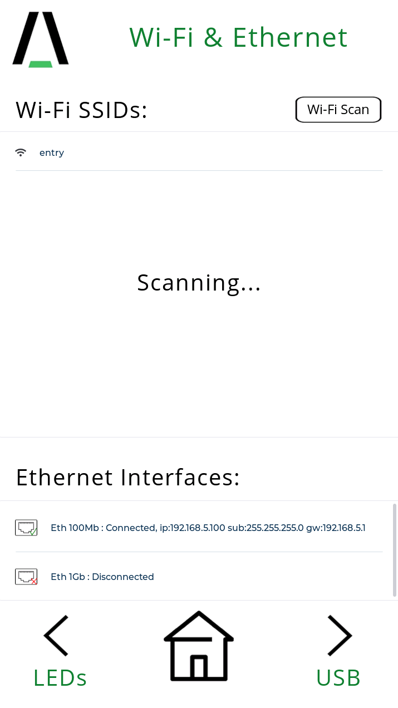
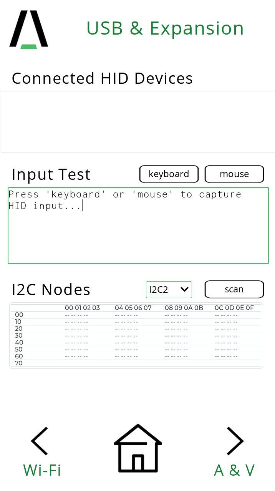
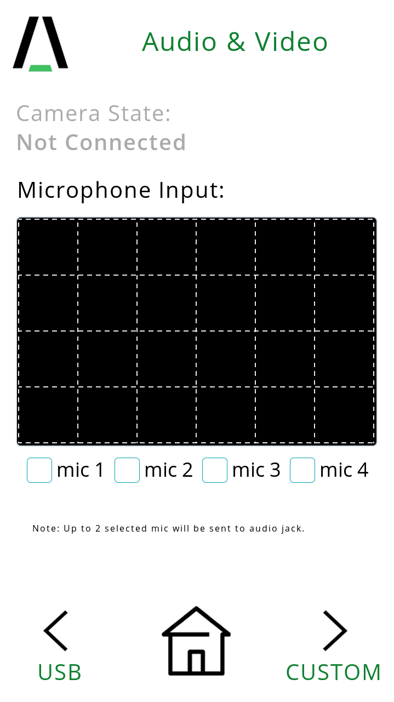

# MaaXBoard-RT-Demo

This program demonstrates the basic functionality of MaaXBoard-RT board. It includes:
- GUI pages built by free GUI-Guider tool from nxp. Total 6 pages:
    1. Led Control
    2. Wi-fi & Network
    3. USB & Expansion
    4. Audio & Video
    5. Custom
    6. Help & Info 
- basic connectivity application using Ethernet 100Mb, Ethernet 1Gb, Wifi.
- USB peripherals and IO Expansion (usb mouse, keyboard, i2c scan).
- audio test program using 4 onboard microphones.

**Table of Contents**

1. [Required Hardwares](#Required-Hardwares)
	1. [MaaXBoard RT board](#Maaxboard-RT-board)
    2. [MCU-Link debug probe](#mcu-link-debug-probe)
	2. [MIPI DSI 7-INCH CAPACITIVE TOUCH DISPLAY (Optional)](#mipi-dsi-7-inch-capacitive-touch-display-optional)   

2. [Mode of Operation](#mode-of-operation)
    1. [Console mode](#console-mode)
    2. [Gui mode](#gui-mode)    
3. [Project structure](#project-structure)
4. [Add new cli command](#add-new-cli-command)

# Required Hardwares

## MaaXBoard-rt-board 

[](https://www.avnet.com/wps/portal/us/products/avnet-boards/avnet-board-families/maaxboard/maaxboard-rt/)
- NXP i.MX RT1176 Processor
- Arm Cortex-M7 @1GHz, 32KB/32KB L1 Cache
- Arm Cortex-M4F @400MHz, 16KB/16KB L1 Cache
- Fast Real-time, low-latency response (12ns)
- 2D GPU and Graphics Accelerator
- Advanced Security (on RT1176 plus TO136 Device)
- 2MB of Fast On-Chip SRAM
- (includes 512KB of A7 TCM and 256KB M4 TCM)
- 256 Mb Onboard SDRAM
- 256 Mb Onboard HyperFlash

## MCU-Link debug probe

[](https://www.avnet.com/wps/portal/us/products/avnet-boards/avnet-board-families/maaxboard/maaxboard-rt/)

## MIPI DSI 7-INCH CAPACITIVE TOUCH DISPLAY (Optional)

[](https://www.avnet.com/wps/portal/us/products/avnet-boards/avnet-board-families/maaxboard/maaxboard-rt/)

# Mode of Operation
## Console mode
User with no MIPI 7-inch display can run the demo completely from console. MaaXBoard RT CLI use LPUART1 on J17 Debug UART 3 pin header.
Baudrate is 115200.

*Note: If running without display, following definition in globals.h must be set 0*
```
#define GUI_EN			0
```
List of supported commands:
```
--------- PERIPHERALS ----------------
 led ***    : RGB LEDs on/off
 i2c #      : I2C Scan (bus# 2/3/5/6)
--------- WIFI & LAN -----------------
 ws         : Wifi Scan
 wc         : Wifi Connect
 wi         : Wifi Info
 es         : Ethernet Scan
 -------- USB HOST & DEV -------------
 ul         : USB List (attached devices)
 uk         : Keyboard Test
 um         : Mouse Test
--------- AUDIO & VIDEO --------------
 am ##      : Audio L/R output (mic# 1-4)
--------- UTILITY --------------------
 stats      : RTOS Statistics
 clr        : Clear the terminal
 q/ctrl+c   : Abort the command
 ? / h      : Menu Help
========= Avnet GUI Demo v1.0 [2021-06-25]
```

## GUI mode
In order to run in GUI mode, (720x1280) 7inch MIPI display is required. Menu can be navigated using touch display or usb mouse.






Depending on the orientation, user may want to rotate the screen by 180 degree. To do that, `AVT_DISPLAY_ROTATE_180` must defined in the preprocessor under project settings.
# Project Structure

* `generated/`
	* Gui-guider generated source files
* `sources/`
	* application source files
* `board/`
	* `board.c/h`
		* board specific definitions
	* `clock_config.c/h`
		* generated clock configuration from MCUXpresso configurator
	* `pin_mux.c/h`
		* generated pin configuration from MCUXpresso configurator
* `littlevgl/`
	* lvgl graphics library version 7.11
* `wifi/`
	* wifi driver, bluetooth firmware

The main function is located under `source/littlevgl_guider.c`
There are total 10 freertos tasks running. 

# Add new cli command
MaaXBoard-demo uses [FREERTOS+CLI](https://www.freertos.org/FreeRTOS-Plus/FreeRTOS_Plus_CLI/FreeRTOS_Plus_Command_Line_Interface.html) framework. Basically following 3 steps must be done. Look for other function implementations in `source/UART_CLI.c`

 1. create the function with these 3 parameters. pcWriteBuffer is the output buffer sending string to console, after command execution. 
 ```
    static BaseType_t newFunction( char *pcWriteBuffer,size_t, 
                    xWriteBufferLen, const char *pcCommandString ){}
 ```
 2. create the new struct like below
 ```
    static const CLI_Command_Definition_t taskNewFuncCommandStruct =
    {
        "newfunc",
        "--------- UTILITY --------------------\r\n"
        " newfunc      : newfunc description \r\n",
        newFunction,
        0
    };
```
 3. Register the new command
 ```
    FreeRTOS_CLIRegisterCommand(&taskNewFuncCommandStruct)
 ```

# Reference

* [MaaXBoard-rt](https://www.avnet.com/wps/portal/us/products/avnet-boards/avnet-board-families/maaxboard/maaxboard-rt/)
